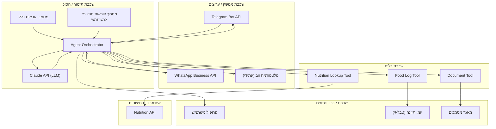
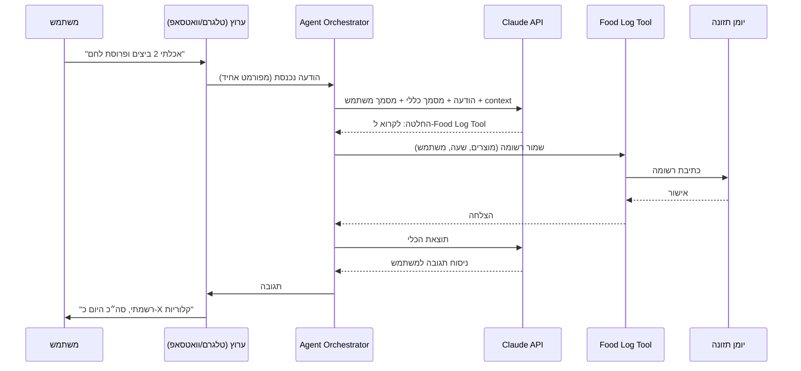

# מסמך ארכיטקטורה – סוכן מאמן תזונה (Coach Agent)

> טיוטה ראשונית, מבוססת על [מסמך דרישות.md](מסמך%20דרישות.md). יתעדכן בהמשך.

## 1. עקרון מנחה

המערכת בנויה בשכבות (layers), כך שהלוגיקה של הסוכן עצמו לא תלויה בערוץ התקשורת הספציפי (טלגרם/וואטסאפ/פלטפורמה עתידית), ולא תלויה ישירות במימוש הכלים החיצוניים (API, מסד נתונים). זה מאפשר להחליף ערוץ תקשורת או ספק API בלי לשנות את ליבת הסוכן.

## 2. שכבות המערכת

### 2.1 שכבת ממשק / ערוצים (Interface / Channel Layer)

אחראית על קבלת ושליחת הודעות מול המשתמש.

- אינטגרציה מול Telegram Bot API 
- בעתיד: ממשק ווב/אפליקציה.
- תפקיד מרכזי: לתרגם הודעה נכנסת מהפורמט הספציפי של הערוץ לפורמט אחיד פנימי (ולהפך בתשובה), כך ששאר המערכת "לא יודעת" מאיזה ערוץ ההודעה הגיעה.

### 2.2 שכבת תזמור / הסוכן (Orchestration / Agent Layer)

הליבה הלוגית של המערכת.

- מרכיבה את הפרומפט לכל אינטראקציה משני מקורות: **מסמך הוראות כללי** + **מסמך הוראות ספציפי למשתמש**.
- מנהלת את היסטוריית השיחה (context) מול המשתמש.
- מחליטה מתי צריך להפעיל כלי (tool) — למשל שליפת קלוריות ממוצר, כתיבה ליומן, יצירת/שליפת מסמך — ומתי לענות ישירות.
- קוראת ל-LLM (Claude API) עם ההקשר וההוראות הרלוונטיים.

### 2.3 שכבת כלים (Tools Layer)

פונקציות מוגדרות שהסוכן יכול "לקרוא" להן:

- **Nutrition Lookup Tool** — שליפת ערכים תזונתיים (קלוריות וכו') ממוצר, מול API חיצוני.
- **Food Log Tool** — כתיבה/קריאה מהזיכרון הטבלאי (למשל: "מה אכלתי היום").
- **Document Tool** — יצירה, עריכה ושליפה של מסמכים מובנים (הגדרת מטרות, דיאגרמות) יחד עם המשתמש.

### 2.4 שכבת זיכרון ונתונים (Memory & Data Layer)

מקום האחסון בפועל:

- **פרופיל משתמש** — כולל את מסמך ההוראות הספציפי למשתמש (מטרות, מגבלות, היסטוריה).
- **יומן תזונה טבלאי** — טבלה/מסד נתונים עם רשומות של מה נאכל ומתי.
- **מאגר מסמכים** — מסמכי מטרות/דיאגרמות שנוצרו יחד עם המשתמש.

### 2.5 שכבת אינטגרציות חיצוניות (External Integrations)

- ספק ה-LLM (Claude API).
- API לערכים תזונתיים.
- APIs של ערוצי התקשורת (טלגרם/וואטסאפ).

## 3. דיאגרמת שכבות (Component Diagram)

## 4. דיאגרמת רצף – דוגמה: דיווח על ארוחה

## 5. שאלות פתוחות / לבירור בהמשך

- היכן תרוץ המערכת בפועל בסקאלה גדולה יותר (כשיהיה יותר ממשתמש בודד)? בשלב הראשון (Phase 2 ב-TODO) הוחלט: VM בודד ב-Oracle Cloud Free Tier, polling, ללא serverless.
- איזה מסד נתונים מתאים ליומן הטבלאי (SQL כמו Postgres, או משהו קליל יותר בשלב א')?
- מאגר המסמכים (מטרות/דיאגרמות) — קבצים (כמו Markdown, בדומה למסמך הזה) או מסד נתונים ייעודי?

## 6. קשר למסמך הדרישות

כל שכבה כאן ממפה ישירות ליכולת מהדרישות:

- שכבת כלים 2.1 (Nutrition Lookup) ← דרישה 4.1 (בדיקת ערכים תזונתיים דרך API).
- שכבת כלים 2.2 (Food Log) + שכבת נתונים ← דרישה 4.2 (זיכרון טבלאי / יומן תזונה).
- שכבת כלים 2.3 (Document Tool) + מאגר מסמכים ← דרישה 4.3 (הכנת מסמכים משותפת).
- שכבת תזמור (GEN + USR) ← דרישה 3 (שני מסמכי הוראות).

